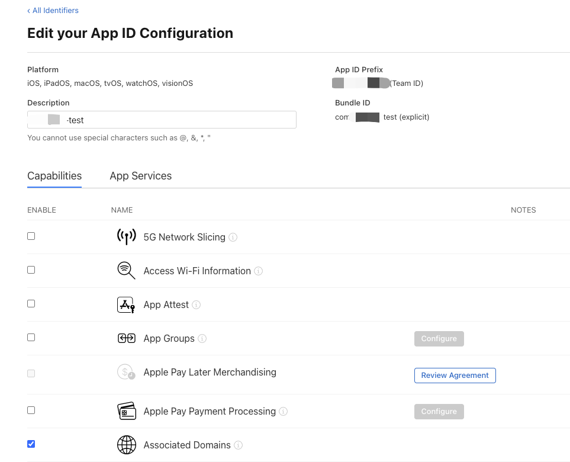

# Universal Links

## Apple Developer 设置

BundleId设置Associated Domains Enable



## 增加配置文件

网站以`test.cn`为例

新增apple-app-site-association

```json
{
  "applinks": {
    "apps": [],
    "details": [
      {
        "appID": "TeamID.com.xxx.test",
        "paths": [
          "*"
        ]
      }
    ]
  }
}
```

上传到网站根目录或`.well-known`文件夹下

通过网址
https://test.cn/apple-app-site-association
或者
https://test.cn/.well-known/apple-app-site-association
访问或下载文件

使用苹果官方工具验证是否正常访问

https://app-site-association.cdn-apple.com/a/v1/test.cn

## uniapp配置

[官方配置说明](https://uniapp.dcloud.net.cn/tutorial/app-ios-capabilities.html)

修改manifest.json

```json
"capabilities" : {
    "entitlements" : {
        "com.apple.developer.associated-domains" : [ "applinks:test.cn" ]
    }
}
```

## 验证

安装app

Safari中打开`https://test.cn`应该有打开xxx的选项，说明可以触发跳转


## nginx配置

```
server {
  listen       443 ssl;
  server_name  test.cn www.test.cn;

  ssl_certificate      /usr/local/nginx/cert/test.cn.pem;
  ssl_certificate_key  /usr/local/nginx/cert/test.cn.key;

  ssl_session_cache    shared:SSL:1m;
  ssl_session_timeout  5m;

  location /.well-known/apple-app-site-association {
    default_type 'application/json';
    # 确保文件路径正确
    alias /usr/local/nginx/html/apple-app-site-association;
  }

  location /apple-app-site-association {
    default_type 'application/json';
    # 确保文件路径正确
    alias /usr/local/nginx/html/apple-app-site-association;
  }
}
```

## 微信分享

注册微信开放平台，新建移动应用，获取APPID`wx123xxxxx`

开发配置-iOS应用 `Universal Links`为`https://test.cn/`

修改manifest.json

```json
"share": {
    "weixin": {
        "appid": "wx123xxxxx",
        "UniversalLinks": "https://test.cn/"
    }
},
```