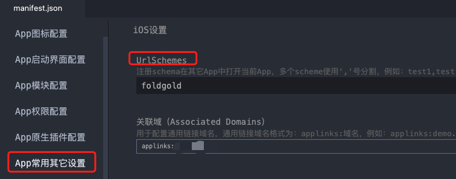

# UrlSchemes

iOS系统中，由于沙盒的限制，导致程序之间相互隔离，需要url scheme协议来实现程序间的通信，通过定义自己的scheme协议，可以非常方便的实现其它三方App调用你的App。

[uniapp官方文档](https://uniapp.dcloud.net.cn/tutorial/app-ios-schemes.html)

## 设置UrlSchemes

修改manifest.json

### 可视化界面配置



### 源码配置

manifest.json
```json
{
    "app-plus": {
        "ios": {
            "urltypes": "foldgold"
        }
    }
}
```

## 浏览器中通过href启动应用

安装app后，可在Safari中点击打开app

```html
<a href="foldgold://abc">打开app</a>
```

## 参数获取

```js
onShow: function() {
	const args = plus.runtime.arguments
	if (args) {
		// 处理args参数，如直达到某新页面等
	}
}
```
