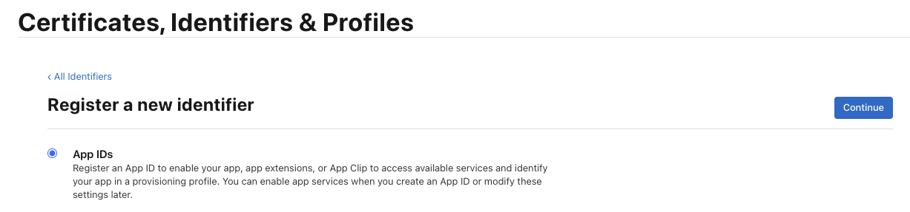
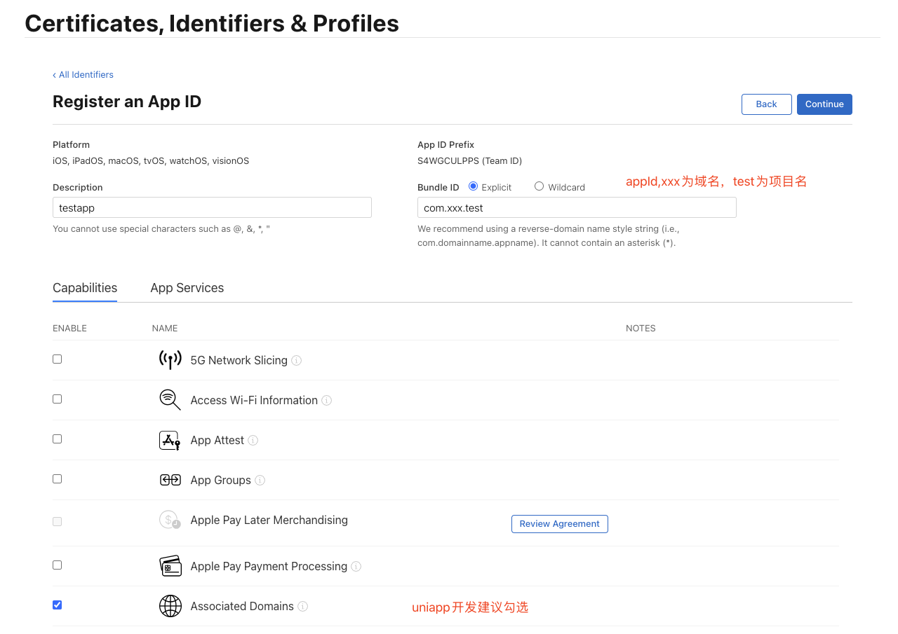
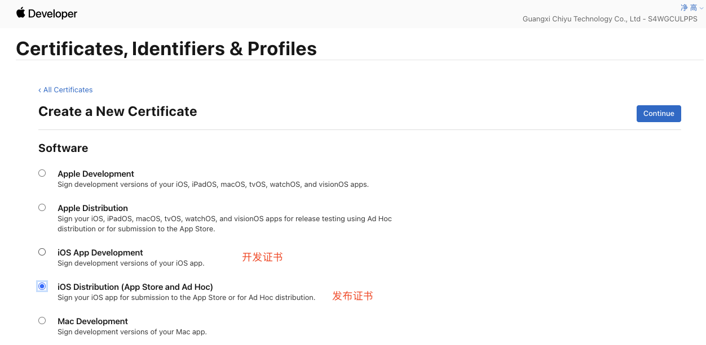
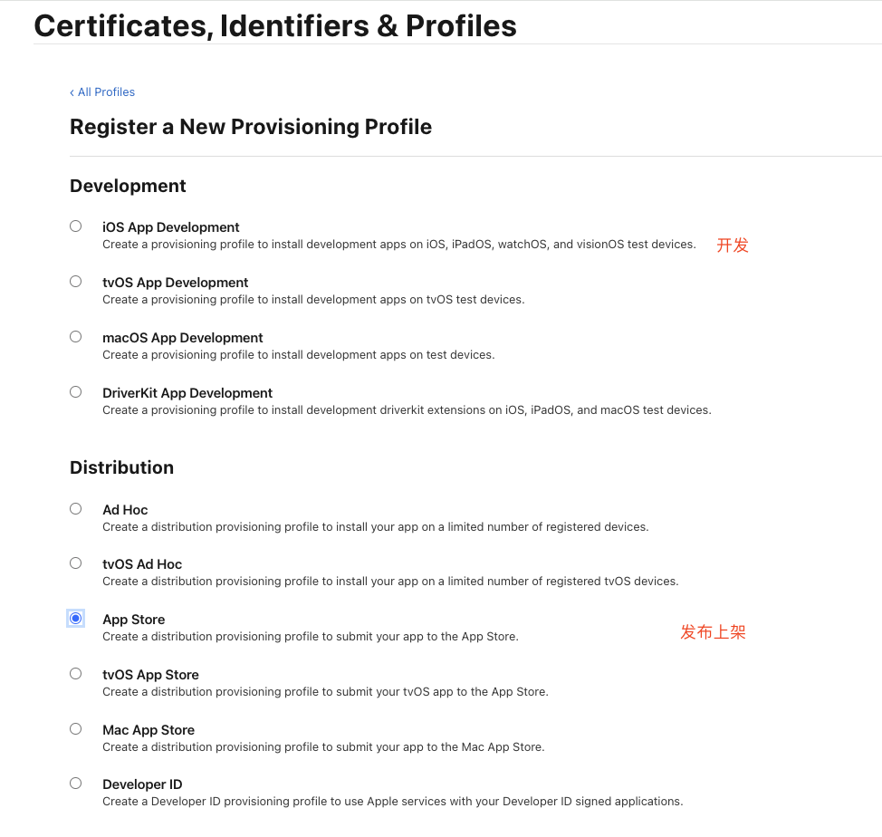
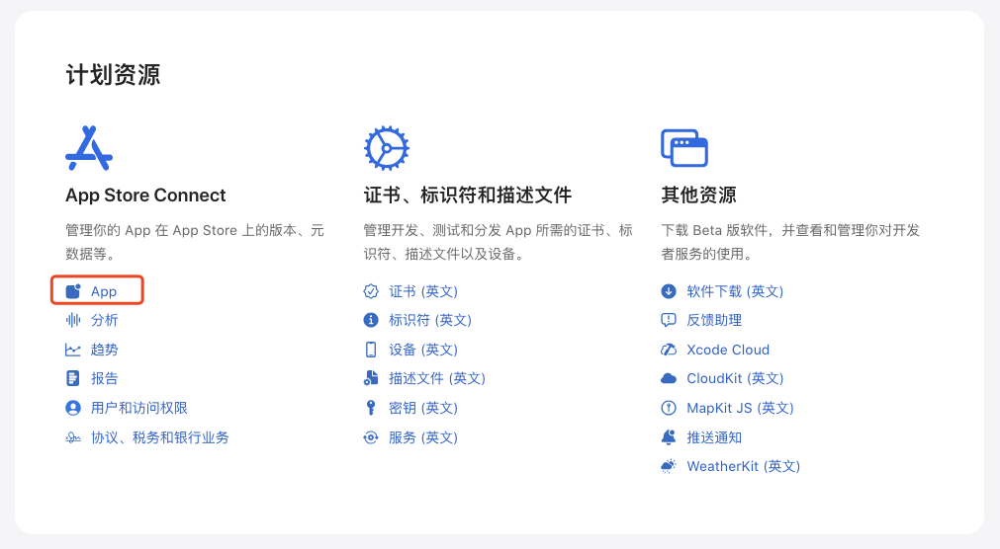
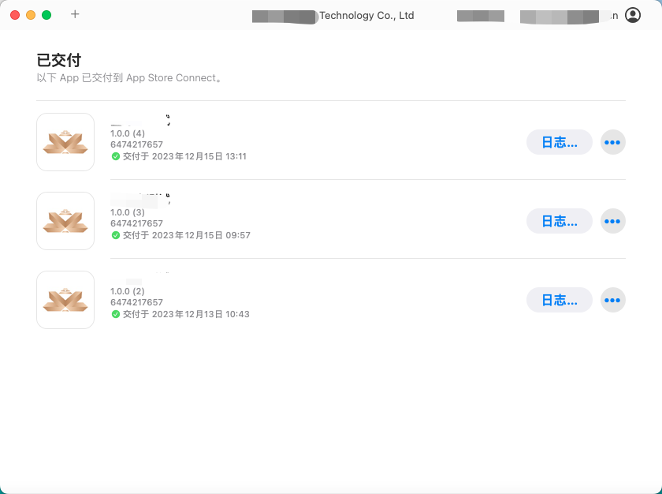
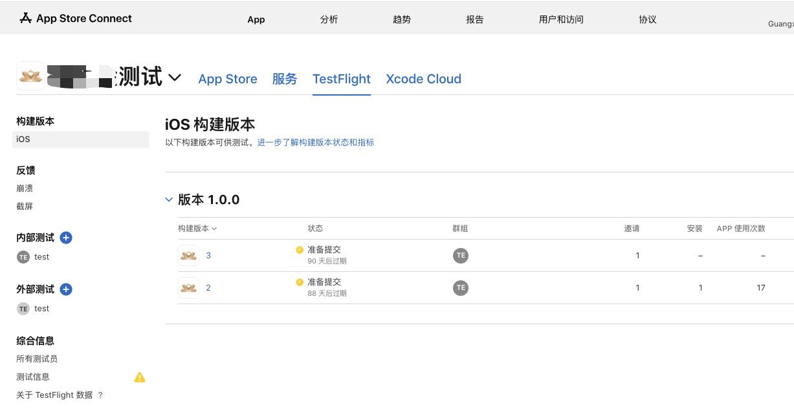

# 发布iOS App基本流程

账号注册步骤省略，如果是个人开发者，缴纳年费即可，公司开发者需要申请邓白氏编码后缴费加入。

基本步骤

1. 创建AppID
2. 创建证书请求文件 （CSR文件）
3. 创建发布证书 （CER）
4. 创建Provisioning Profiles配置文件 （PP文件）
5. 在App Store创建应用
6. 打包代码并上传
7. 填写信息申请上架

## 创建AppID

identifier

配置信息

## 创建证书请求文件

Mac电脑操作

钥匙串访问–证书助理–从证书颁发机构请求证书

最终获得文件CertificateSigningRequest.certSigningRequest

## 创建发布证书

Certificates

分别新增开发和发布证书

会需要上传CertificateSigningRequest.certSigningRequest

生成可得到cer文件

右键导出p12文件

## 创建Provisioning Profiles配置文件

选择类型开发或发布

最终得到xxx.mobileprovision文件

## 在App Store创建应用

## 打包代码并上传

Mac电脑可使用工具Transporter上传

## 填写信息申请上架

上架前需要测试，TestFlight能快速进行测试

测试通过后，在App Store中填写必要信息就可以提交审核，审核通过即可上架苹果商店
