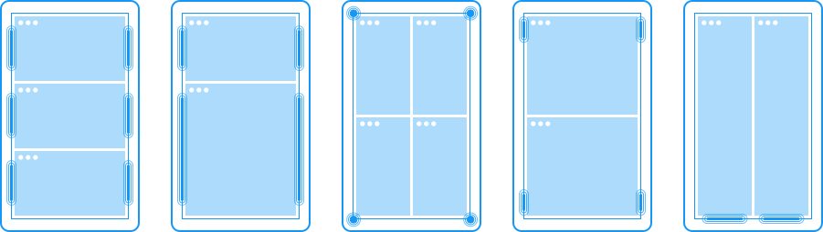
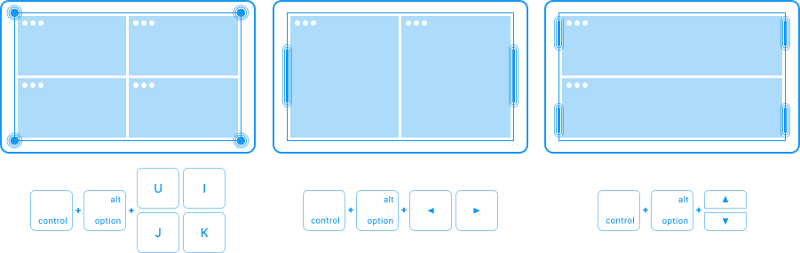

# 分屏工具Magnet

[Magnet官网](http://magnet.crowdcafe.com/)



## 安装

[官方下载](https://apps.apple.com/cn/app/magnet/id441258766)

如果是从网络下载的软件，容易出现提示'这个软件已损坏'，解决办法：

系统偏好设置 -> 安全性与隐私 -> 通用 -> 选择“任何来源”

```bash
# 显示"任何来源"选项在控制台中执行
sudo spctl --master-disable
```

好了，现在软件可以打开了，记得把spctl给开启，安全第一啊

```bash
# 不显示"任何来源"选项在控制台中执行，默认值
sudo spctl --master-enable
```

安装完毕，系统偏好设置-安全性与隐私-辅助功能，会多一个选项，这个要打开左下角的锁然后勾选，才能生效。

## 使用说明

