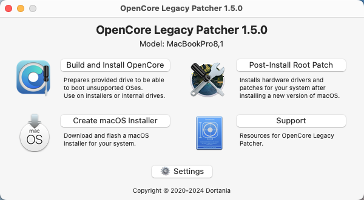
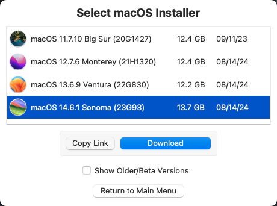
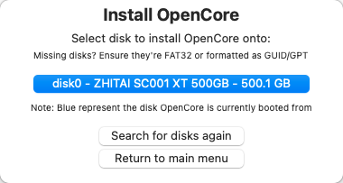
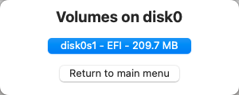
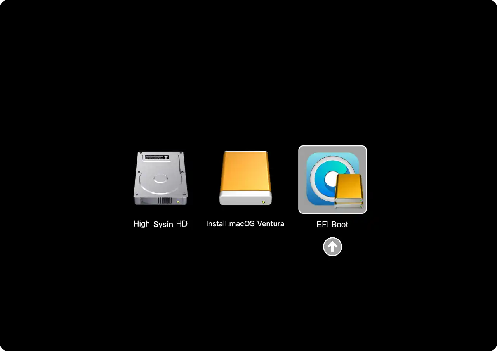
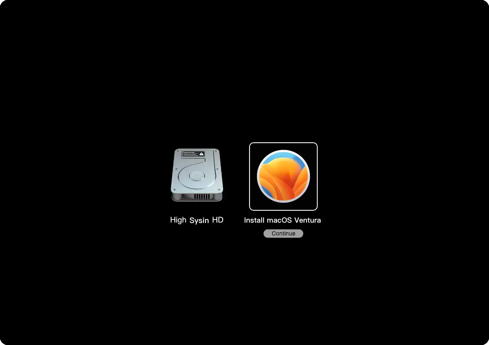
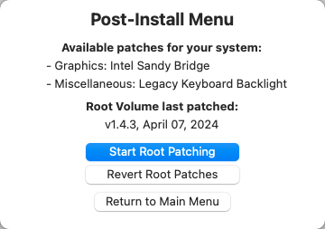
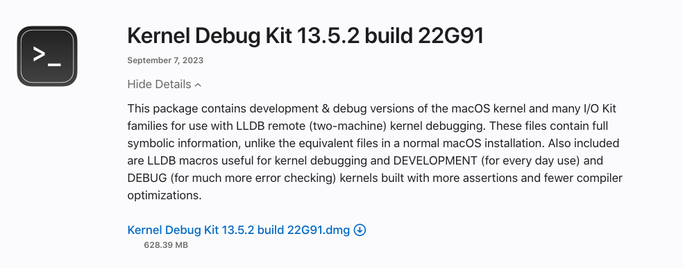
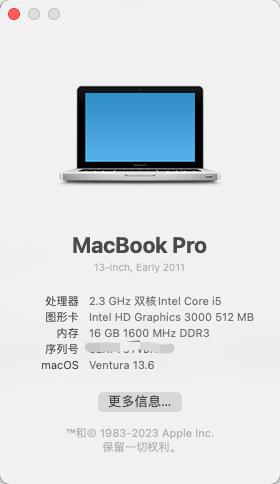

# 在不受支持的 Mac 上安装 macOS Ventura

通过安装`OpenCore Legacy Patcher`实现老机器安装新系统【苹果官方已不支持】

例如： MacBook Pro 2011 可以安装 macOS Ventura

## 安装步骤

下载最新安装包，github仓库release

图形化工具：OpenCore-Patcher-GUI.app.zip

https://github.com/dortania/OpenCore-Legacy-Patcher/releases

## 制作系统安装盘

使用一个容量大于16G的U盘或移动硬盘，需要先格式化来制作安装盘，这个步骤可以安装官网说明制作

以下为快捷方式，通过2选1的模式直接制作系统安装盘

Create macOS Installer

- Download macOS Installer      下载安装包，老系统无法直接下载新系统，这个选项非常棒
- Use existing macOS Installer  使用已下载好的安装包

## 安装启动准备

Build and Install OpenCore

老系统无法直接安装新系统，会提升不兼容，需要在硬盘上安装一些工具，安装完成后会弹出提示，点击 “Install to disk” 即可，选择要安装的磁盘，一般disk0 为电脑内置磁盘，

出现 EFI 分区选择界面，点击即可。

这个步骤会生成一个启动时有1个`EFI启动区`，通过这个启动区安装新系统就不会提示不兼容

# 重启电脑，安装新系统

按住`Option`，直到出现启动选择画面

1. 选择带有 OpenCore 徽标的 EFI Boot 图标
2. 选择安装新系统

网上找了2个图，直观的说明

强烈建议格式化磁盘全新安装

## 重新安装OLP

新系统如果是全新安装的，需要重新下载软件，并执行`Build and Install OpenCore`，安装在内置磁盘，保证可正常启动

## 安装系统补丁

Post-Install Root Patch

系统安装完成后，需要安装补丁用于解决兼容问题

软件会自动查询需要下载的补丁包，下图为安装成功后截图，第一次打开如果``可点击，就需要安装

部分电脑可能安装新系统后无法上网，需要在其他电脑下载补丁包

苹果官网下载地址，根据新系统选择对应的补丁包，比如`macOS Ventura`下载`Kernel Debug Kit 13.5.2 build 22G91`

https://developer.apple.com/download/all/?q=Kernel%20Debug%20Kit

## 成果展示

升级成功

