# 邓白氏编码申请

> 根据2023年11月申请过程记录

申请苹果企业开发者必须提供邓白氏编码

## 查找你的 D-U-N-S 编号

> 在注册之前，请先确认你的机构是否拥有 D-U-N-S 编号。Dun & Bradstreet 可能已向你分配该编号。如果你的机构未被列出，你可选择向 D&B 提交信息，免费申请一个 D-U-N-S 编号。

[查找你的 D-U-N-S 编号](https://developer.apple.com/enroll/duns-lookup)

首先需要登陆apple ID

全部需要填写英文或者拼音，【法人实体名称】是指公司名称，用百度翻译下就行，填写完成后点击【继续】，会提示【未能找到您的组织】，最下方勾选复选框后可【提交】

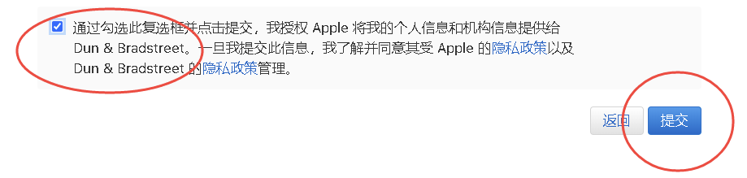

填写信息完整的情况下会出现以下提示

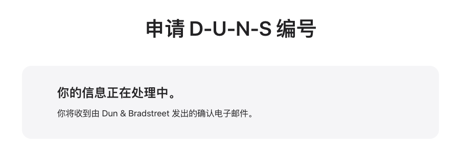

## 关注邮件

正常情况，当天会收到邮件，表示对方已收到提交的信息，无需回复

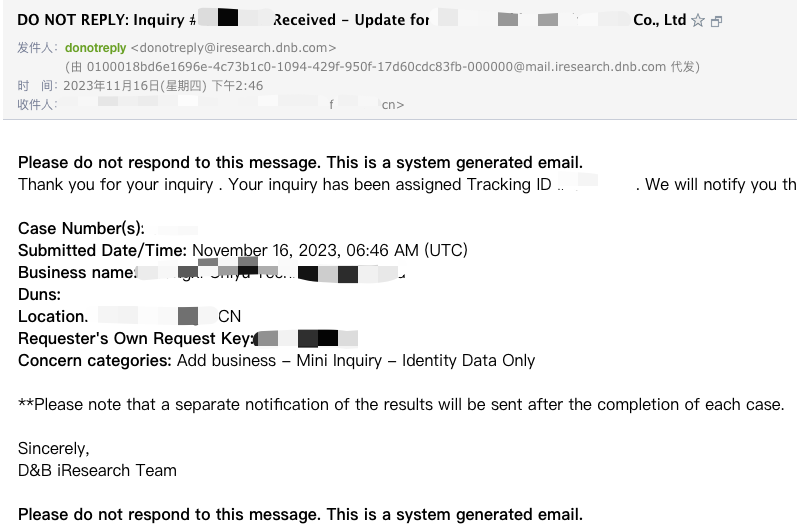

## 补充材料邮件

第二天，收到了邮件，需要登陆网站补充资料

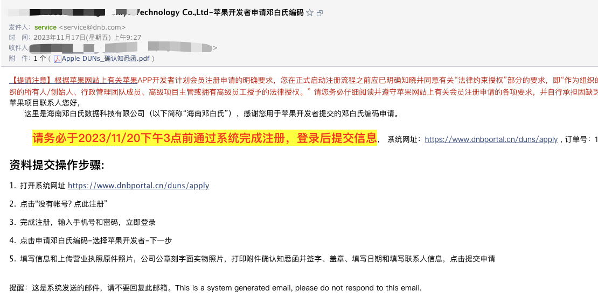

按照说明，需要先注册账号，然后开始申请，分三步

### 第一步

选择申请类型：苹果开发者

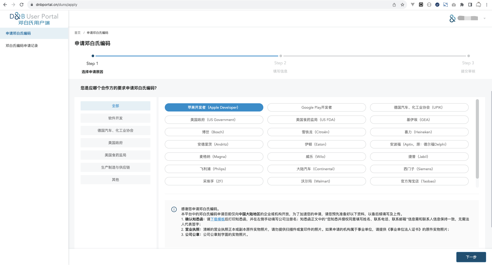

### 第二步

填写具体资料

#### 企业基本信息

主营业务：参照营业执照中信息（如：技术服务、技术开发、技术咨询、技术交流、技术转让、技术推广）

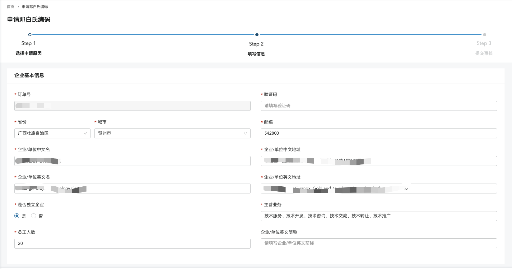

#### 联系人信息

需要和【确认知悉函】里的联系人信息保持一致

- 职务：开发负责人

- 申请目的：用于申请公司苹果开发者账号

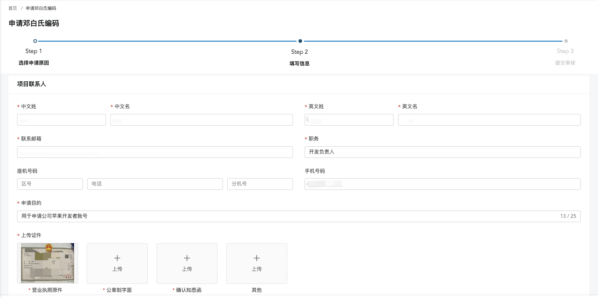

#### 上传证件

有明确要求

- 确认知悉函:请下载模板后打印知悉函，并在左侧手动填写公司的完整注册名称；知悉函正文中的“您知悉并授权同意，填写姓名， 联系电话，联系邮箱”需要和联系人信息保持一致；知悉函无需法人代表签字；
- 营业执照:清晰的营业执照正本或副本原件实物照片，请勿提供扫描件或复印件的照片。如果申请的机构属于事业单位，请提供《事业单位法人证书》的原件实物照片；
- 公章:公司公章刻字面的实物照片。

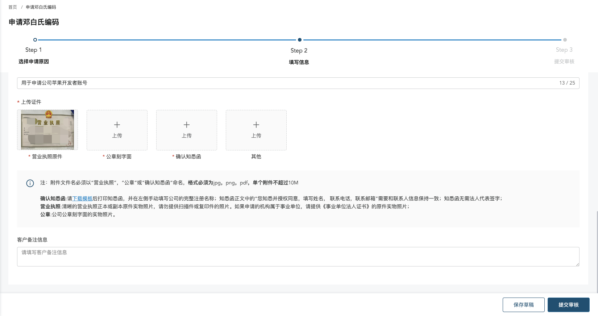

填写完成后提交，会提示如下

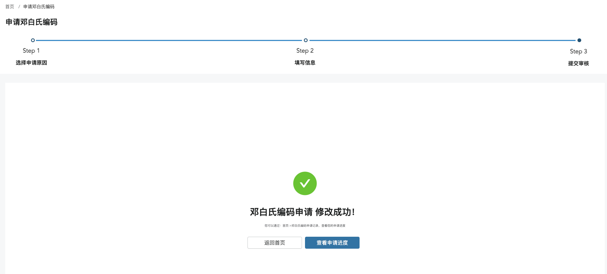

同时收到邮件

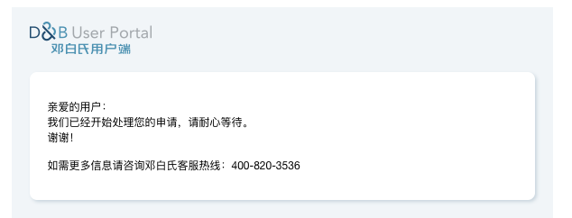

## 等待下发

因为是周五下午提交的，周一才收到邮件，通知审核完成

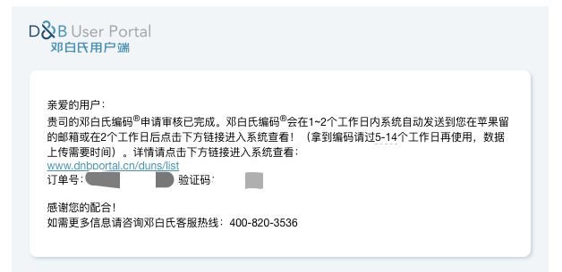

到此，邓白氏编码申请完成，效率还是比较高的，也比想象中方便。
