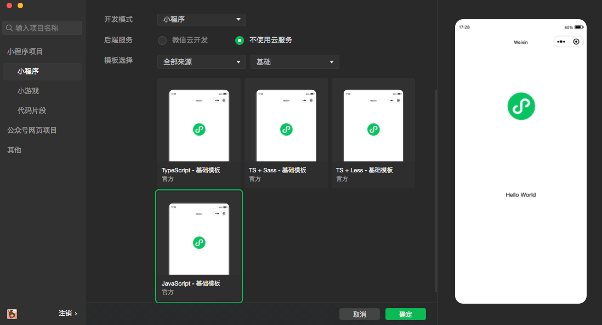
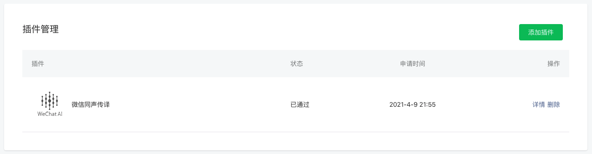

# 微信小程序开发

## 开发前准备

- 注册帐号 [微信公众平台](https://mp.weixin.qq.com/)
- 下载开发者工具 [官方下载地址](https://developers.weixin.qq.com/miniprogram/dev/devtools/download.html)
- 微信官方文档 [小程序](https://developers.weixin.qq.com/miniprogram/dev/framework/quickstart/)

## 新建项目

通过开发者工具可以快速新建项目，一般选择官方基础模版即可



会自动生成目录

```
├── app.js
├── app.json
├── app.wxss
├── pages
│   ├── index
│   │   ├── index.js
│   │   ├── index.json
│   │   ├── index.wxml
│   │   └── index.wxss
│   └── logs
│       ├── logs.js
│       ├── logs.json
│       ├── logs.wxml
│       └── logs.wxss
├── project.config.json
├── sitemap.json
└── utils
    └── util.js
```

### 配置小程序

- app.json [全局配置](https://developers.weixin.qq.com/miniprogram/dev/framework/config.html)
- index.json [页面配置](https://developers.weixin.qq.com/miniprogram/dev/framework/config.html)
- sitemap.json [sitemap配置](https://developers.weixin.qq.com/miniprogram/dev/framework/sitemap.html)


## 新建页面

微信给了2个页面的示例，可以在`pages`目录上右键-[新建文件夹]，然后再新的文件夹上右键-[新建Page]，软件自动把页面的4个文件生成，而且会在`app.json`中自动添加新的页面，直接按需修改新生成的4个文件即可

[目录结构](https://developers.weixin.qq.com/miniprogram/dev/framework/structure.html)

- index.js js方法 [事件系统](https://developers.weixin.qq.com/miniprogram/dev/framework/view/wxml/event.html)
- index.json 页面配置，使用组件，开启下拉刷新，上拉加载更多等
- index.wxml 比较像html结构，但标签使用微信自有的一套，就是那么自信[wxml](https://developers.weixin.qq.com/miniprogram/dev/framework/view/wxml/)
- index.wxss css的兄弟，这个还是近亲关系，基本都能复用[wxss](https://developers.weixin.qq.com/miniprogram/dev/framework/view/wxss.html)


```json
{
  "usingComponents": {
    "wemark": "/wemark/wemark"
  },
  "enablePullDownRefresh": true,
  "navigationBarTitleText": "页面标题"
}
```

## 开放接口

- 登录 [wx.login](https://developers.weixin.qq.com/miniprogram/dev/api/open-api/login/wx.login.html)
- 获取用户信息 [wx.getUserProfile](https://developers.weixin.qq.com/miniprogram/dev/api/open-api/user-info/wx.getUserProfile.html)

::: tip 获取用户信息

页面产生点击事件（例如 button 上 bindtap 的回调中）后才可调用，每次请求都会弹出授权窗口，用户同意后返回 userInfo。该接口用于替换 wx.getUserInfo，详见 [用户信息接口调整说明](https://developers.weixin.qq.com/community/develop/doc/000cacfa20ce88df04cb468bc52801)。

:::

## 使用插件

好用的工具用起来，比如腾讯的地图、语音转译，专业且免费

在使用插件前，首先要在小程序管理后台的“设置-第三方服务-插件管理”中添加插件



[插件使用说明](https://developers.weixin.qq.com/miniprogram/dev/framework/view/wxml/event.html)

### 语音转译

使用【微信同声传译插件】插件直接一条龙

app.json

```json
{
  "plugins": {
    "WechatSI": {
      "version": "0.3.5",
      "provider": "wx069ba97219f66d99"
    }
  }
}
```

在需要使用的页面js下加载插件

index.js

```js
const plugin = requirePlugin("WechatSI")
let manager = plugin.getRecordRecognitionManager()

Page({
  data: {
    content: '', // 语音转译结果
  },
  // 页面首次加载，设置插件事件
  onLoad: function (options) {
    manager.onStop = (res) => {
      this.setData({
        content: res.result,
      })
    }
    manager.onStart = (res) => {
      wx.showModal({
        title: '提示',
        content: '开始录音',
        showCancel: false,
        confirmText: '结束录音',
        success: (res) => {
          this.stopRecordToText()
        }
      })
    }
  },
  // 录音并转文字
  startRecordToText: function () {
    manager.start()
  },
  // 停止录音
  stopRecordToText: function () {
    manager.stop()
  },
})
```

index.wxml

```html
<view bindtap="startRecordToText">语音识别</view>
```


## API

### 基础

- 获取设备基础信息 [wx.getDeviceInfo](https://developers.weixin.qq.com/miniprogram/dev/api/base/system/wx.getDeviceInfo.html)
- 获取当前帐号信息(可以获取线上小程序版本号) [wx.getAccountInfoSync](https://developers.weixin.qq.com/miniprogram/dev/api/open-api/account-info/wx.getAccountInfoSync.html)

### 路由

- 保留当前页面，跳转到应用内的某个页面 [wx.navigateTo](https://developers.weixin.qq.com/miniprogram/dev/api/route/wx.navigateTo.html)
- 关闭当前页面，跳转到应用内的某个页面 [wx.redirectTo](https://developers.weixin.qq.com/miniprogram/dev/api/route/wx.redirectTo.html)
- 关闭当前页面，返回上一页面或多级页面 [wx.navigateBack](https://developers.weixin.qq.com/miniprogram/dev/api/route/wx.navigateBack.html)

### 界面

:::tip

wx.showLoading 和 wx.showToast 同时只能显示一个
wx.showToast 应与 wx.hideToast 配对使用

:::

- 显示消息提示框 [wx.showToast](https://developers.weixin.qq.com/miniprogram/dev/api/ui/interaction/wx.showToast.html)
- 显示模态对话框 [wx.showModal](https://developers.weixin.qq.com/miniprogram/dev/api/ui/interaction/wx.showModal.html)
- 显示 loading 提示框 [wx.showLoading](https://developers.weixin.qq.com/miniprogram/dev/api/ui/interaction/wx.showLoading.html)

### 网络

需要先根据官方说明做域名配置，[网络使用说明](https://developers.weixin.qq.com/miniprogram/dev/framework/ability/network.html)

- 请求网络 [wx.request](https://developers.weixin.qq.com/miniprogram/dev/api/network/request/wx.request.html)
- 上传文件 [wx.uploadFile](https://developers.weixin.qq.com/miniprogram/dev/api/network/upload/wx.uploadFile.html)
- 下载文件 [wx.downloadFile](https://developers.weixin.qq.com/miniprogram/dev/api/network/upload/wx.downloadFile.html)

### 数据缓存

同步方法好用哟，和localStorage差不多啦，有类型和大小的限制

- 设置缓存 [wx.setStorageSync](https://developers.weixin.qq.com/miniprogram/dev/api/storage/wx.setStorageSync.html)
- 读取缓存 [wx.getStorageSync](https://developers.weixin.qq.com/miniprogram/dev/api/storage/wx.getStorageSync.html)
- 移除缓存 [wx.removeStorageSync](https://developers.weixin.qq.com/miniprogram/dev/api/storage/wx.removeStorageSync.html)
- 清空缓存 [wx.clearStorageSync](https://developers.weixin.qq.com/miniprogram/dev/api/storage/wx.clearStorageSync.html)
- 获取缓存信息 [wx.getStorageInfoSync](https://developers.weixin.qq.com/miniprogram/dev/api/storage/wx.getStorageInfoSync.html)

### 媒体

- 地图看起来好复杂，强烈建议直接使用插件，免费好用接入方便

#### 图片、视频

::: tip
不知道为什么iOS15.3上的微信使用`wx.chooseMedia`选择图片后设置了`sizeType`为`['compressed']`后图片未压缩，之前使用`wx.chooseImage`（API不维护了）还是压缩的，只能再加上`wx.compressImage`来手动压缩。
:::

- 选择图片、视频 [wx.chooseMedia](https://developers.weixin.qq.com/miniprogram/dev/api/media/video/wx.chooseMedia.html)
- 压缩图片 [wx.compressImage](https://developers.weixin.qq.com/miniprogram/dev/api/media/image/wx.compressImage.html)


```js
// 选择图片
wx.chooseMedia({
  count: 1,
  sizeType: ['compressed'],
  mediaType: ['image'],
  success: (res) => {
    const {
      tempFiles: [
        {
          size,
          tempFilePath: src
        },
      ],
    } = res
    if (size > 5120000) {
      wx.showToast({
        title: '请选择小于5M的图片',
        icon: 'error'
      })
      return
    }
    wx.compressImage({
      src, // 图片路径
      quality: 80 // 压缩质量
    }).then(res => {
      // 上传图片
      console.log(res.tempFilePath)
    })
  },
  fail: () => {
    wx.showToast({
      title: '图片读取失败',
      icon: 'error',
    })
  }
})
```

#### 录音

最多1分钟，超出自动停止

- 开始录音 [wx.startRecord](https://developers.weixin.qq.com/miniprogram/dev/api/media/recorder/wx.startRecord.html)
- 结束录音 [wx.stopRecord](https://developers.weixin.qq.com/miniprogram/dev/api/media/recorder/wx.stopRecord.html)
- 录音管理器 [wx.getRecorderManager](https://developers.weixin.qq.com/miniprogram/dev/api/media/recorder/wx.getRecorderManager.html)


## WeUI组件库

这是一套基于样式库weui-wxss (opens new window)开发的小程序扩展组件库，同微信原生视觉体验一致的UI组件库，由微信官方设计团队和小程序团队为微信小程序量身设计，令用户的使用感知更加统一。

建议下载代码直接在开发工具中运行体验

- [GitHub](https://github.com/wechat-miniprogram/weui-miniprogram)
- [官方文档](https://wechat-miniprogram.github.io/weui/docs/)

### 引入组件

【强烈推荐】通过 useExtendedLib 扩展库 的方式引入，这种方式引入的组件将不会计入代码包大小。

```json app.json
{
  "useExtendedLib": {
    "weui": true
  },
}
```

### 使用组件

首先在页面的 json 文件加入 usingComponents 配置字段

```json
{
  "usingComponents": {
    "mp-dialog": "weui-miniprogram/dialog/dialog"
  }
}
```

在wxml文件中加入代码

```xml
<button class="weui-btn" type="default" bindtap="openConfirm">确认取消按钮</button>

<mp-dialog title="test" show="{{dialogShow}}" bindbuttontap="tapDialogButton" buttons="{{buttons}}">
  <view>test content</view>
</mp-dialog>
```

在js文件中定义方法

```js
Page({
  data: {
    dialogShow: false,
    buttons: [{
      text: '取消'
    }, {
      text: '确定'
    }],
  },
  openConfirm: function () {
    this.setData({
      dialogShow: true
    })
  },
  tapDialogButton: function () {
    this.setData({
      dialogShow: false,
    })
  },
})
```

## 云服务


- [云服务](https://developers.weixin.qq.com/miniprogram/dev/wxcloud/quick-start/miniprogram.html)
  - 数据库 JSON 数据库
  - 存储 提供了上传文件到云端、带权限管理的云端下载能力
  - 云函数 运行在云端的代码，无需管理服务器，在开发工具内编写、一键上传部署即可运行后端代码


- [微信云开发](https://cloud.weixin.qq.com/cloudbase)