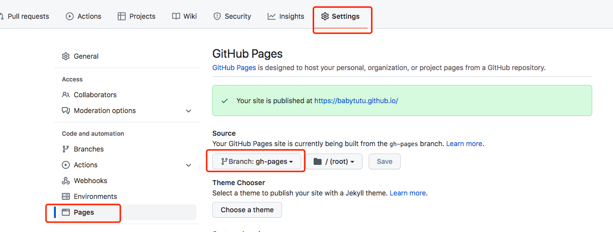

# Vue组件库开发指南

- lerna进行包管理和发布
- rollup+gulp实现打包自动化

## npm发包流程

[命令说明文档](https://docs.npmjs.com/cli/v8/commands)

### 注册npmjs账号

[npmjs](https://www.npmjs.com/)

注册完成后需要登录邮箱通过验证

### 命令行登陆账号

```bash
npm adduser
```

证明是否登录成功

```bash
npm who am i
```

### 创建项目开发包

packege.json

[package-json](https://docs.npmjs.com/cli/v8/configuring-npm/package-json)

|参数|说明|
|---|---|
|name|名称，新开发npm包先去npmjs搜索，没有的才可以|
|version|版本号，新包可以自由设置，一般用0.0.1开始，更新的包版本号必须比已发布的大|
|repository|代码仓库git地址，必须先提交代码再执行发布命令|
|files|只有配置的目录才会打包进去|

### 发布包

保证包名称和版本号唯一

```bash
npm publish
```

### 修改版本号

```bash
npm version <update_type>
```

update_type 说明

- patch：0.1.1-0.1.2
- minor：0.1.1-0.2.0
- major：0.1.1-1.0.0

## lerna基础

Lerna 是一个优化使用 git 和 npm 管理多包存储库的工作流工具，用于管理具有多个包的 JavaScript 项目。

[lerna](https://lerna.js.org/)

lerna仓库目录结构

```
my-lerna-repo/
  package.json
  packages/
    package-1/
      package.json
    package-2/
      package.json
```

### 全局安装

```bash
yarn global add lerna
```

### 常用命令

#### 初始化仓库

```bash
lerna init
```

会自动生成以下文件

```
lerna-repo/
  packages/
  package.json
  lerna.json
```

#### 安装packages下的依赖包

```bash
lerna bootstrap
```

#### 发布到npm

提示更新版本号后直接修改并推送代码到仓库，

```bash
lerna publish
```

#### 查看变更

推送代码后才算

```bash
lerna changed
```

## rollup基础+插件

[rollup官网](https://rollupjs.org/guide/en/)

### 安装

全局安装

```bash
yarn add global rollup
```

根目录新建配置文件rollup.config.js

```js
// rollup.config.js
export default {
  input: 'src/main.js',
  output: {
    file: 'bundle.js',
    format: 'cjs'
  }
}
```

开始打包

```bash
rollup -c rollup.config.js
```

根据[官方文档](https://rollupjs.org/guide/en/#tools)通过添加各种插件实现代码加载，验证，压缩等功能

### 处理外部模块

- @rollup/plugin-node-resolve 告诉 Rollup 如何查找外部模块
- @rollup/plugin-commonjs 将 CommonJS 转换成 ES2015 模块

安装插件

```bash
yarn add -D @rollup/plugin-node-resolve @rollup/plugin-commonjs
```

修改配置

```js
// rollup.config.js
import resolve from '@rollup/plugin-node-resolve'
import commonjs from '@rollup/plugin-commonjs'

export default {
  plugins: [
    resolve(),
    commonjs()
  ]
}
```
### 不打包子依赖包

修改配置

```js
// rollup.config.js
import resolve from '@rollup/plugin-node-resolve'

export default {
  plugins: [
    resolve({
      // pass custom options to the resolve plugin
      customResolveOptions: {
        moduleDirectory: 'node_modules'
      }
    })
  ],
  // indicate which modules should be treated as external
  external: ['lodash']
}
```

### Babel

安装插件和babel工具

```bash
yarn add -D @rollup/plugin-babel @babel/core @babel/preset-env
```

修改配置

```js
// rollup.config.js
import babel from '@rollup/plugin-babel'

export default {
  plugins: [
    babel({
      presets: [
        [
          '@babel/preset-env',
          {
            modules: false
          }
        ]
      ],
      exclude: ['node_modules/**'],
      babelHelpers: 'bundled'
    })
  ]
}
```

### Eslint

with Babel

安装插件

```bash
yarn add -D eslint @rollup/plugin-eslint @babel/eslint-parser
```

修改配置

```js
// rollup.config.js
import eslint from '@rollup/plugin-eslint'

export default {
  plugins: [
    eslint({
      env: {
        browser: true,
        node: true,
        es6: true,
      },
      parser: "@babel/eslint-parser",
      parserOptions: {
        sourceType: "module",
        ecmaVersion: 6,
        allowImportExportEverywhere: false,
        ecmaFeatures: {
          globalReturn: false,
        },
        requireConfigFile: false
      },
      extends: [
        'eslint:recommended',
      ],
      // add your custom rules here
      rules: {
        'no-unused-vars': [0],
      },
    }),
    babel()
  ]
}

```

### Vue

安装插件

```bash
yarn add -D rollup-plugin-vue vue-eslint-parser vue-template-compiler
```

修改配置

```js
// rollup.config.js
import VuePlugin from 'rollup-plugin-vue'

export default {
  plugins: [
    VuePlugin({
      css: true,
      compileTemplate: true
    }),
  ]
}

```

### Postcss

安装插件，如果代码中使用了css预处理器，如`stylus`，需要再安装对应包并配置`extensions`

```bash
yarn add -D rollup-plugin-postcss postcss stylus
```

修改配置

```js
// rollup.config.js
import postcss from 'rollup-plugin-postcss'

export default {
  plugins: [
    postcss({
      extensions: ['.stylus']
    }),
  ]
}
```

### 代码压缩

安装插件

```bash
yarn add -D rollup-plugin-terser
```

修改配置

```js
// rollup.config.js
import terser from 'rollup-plugin-terser'

export default {
  plugins: [
    terser()
  ]
}
```

完整的配置文件

```js
// rollup.config.js
import resolve from '@rollup/plugin-node-resolve'
import commonjs from '@rollup/plugin-commonjs'
import babel from '@rollup/plugin-babel'
import eslint from '@rollup/plugin-eslint'
import VuePlugin from 'rollup-plugin-vue'
import postcss from 'rollup-plugin-postcss'
import terser from 'rollup-plugin-terser'

export default {
  input: 'src/main.js',
  output: {
    file: 'bundle.js',
    format: 'cjs'
  },
  plugins: [
    postcss({
      extensions: ['.stylus']
    }),
    resolve(),
    commonjs(),
    VuePlugin({
      css: true,
      compileTemplate: true
    }),
    eslint({
      env: {
        browser: true,
        node: true,
        es6: true,
      },
      parser: "@babel/eslint-parser",
      parserOptions: {
        sourceType: "module",
        ecmaVersion: 6,
        allowImportExportEverywhere: false,
        ecmaFeatures: {
          globalReturn: false,
        },
        requireConfigFile: false
      },
      extends: [
        'eslint:recommended',
      ],
      // add your custom rules here
      rules: {
        'no-unused-vars': [0],
      },
    }),
    babel({
      presets: [
        [
          '@babel/preset-env',
          {
            modules: false
          }
        ]
      ],
      exclude: ['node_modules/**'],
      babelHelpers: 'bundled'
    }),
    terser()
  ]
}
```

### Gulp

gulpfile.js

```js
// gulpfile.js
const gulp = require('gulp')
const rollup = require('rollup')

gulp.task('build', async function () {
  const bundle = await rollup.rollup({
    input: './src/main.ts',
  })

  await bundle.write({
    file: './dist/library.js',
    format: 'umd',
    name: 'library',
  })
})
```

## gulp基础

[gulp快速入门](https://gulpjs.com/docs/en/getting-started/quick-start)

### 全局安装

```bash
yarn global add gulp
```

使用 async/await

### 创建任务

```js
// gulpfile.js

// 默认gulp任务
const fs = require('fs')

async function asyncAwaitTask() {
  const data = fs.readFileSync('package.json', 'utf-8')
  console.log(data)
  await Promise.resolve('end')
}

exports.default = asyncAwaitTask
```

### 执行任务

```bash
gulp
```

### 查询任务列表

```bash
gulp -T
```

## 部署到GitHub Pages

[GitHub Pages官方文档](https://pages.github.com/)

官方文档讲解了如何配置，可实现在线编辑实时生效，如希望实现本地开发且发布到`gh-pages`分支，可使用gh-pages快速部署，假设静态文件已打包到根目录的`dist`文件夹

### 安装包

```bash
yarn add -D gh-pages
```

修改配置文件package.json

```json
{
  "scripts": {
    "deploy": "gh-pages -d dist"
  }
}
```

发布

```bash
npm run deploy
```

### 配置开启GitHub Pages

Click on the Settings tab and scroll down to the GitHub Pages section.
Then select the `gh-pages` branch source and click on the Save button.

