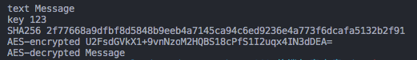

# 前端加密方案

- 参考文档 [https://cryptojs.gitbook.io/docs/](https://cryptojs.gitbook.io/docs/)
- 使用sha-256对用户密码进行加密（不支持解密）
- 使用AES对用户密码进行加密（支持可配置的加密秘钥进行加解密）
## 安装依赖包

引入`crypto-js`

```bash
yarn add crypto-js
```

## node示例

@[code js](@src/components/crypto/index.js)



## vue示例

<ClientOnly>
  <crypto />
</ClientOnly>

@[code vue](@src/components/crypto/demo.vue)
