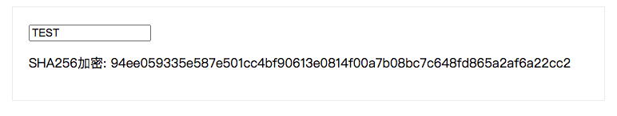

# 前端加密方案

使用sha-256对用户密码进行加密

## 使用方法

引入`crypto-js`

```bash
yarn add crypto-js
```

node环境测试加密效果

```js
/**
 * @see https://cryptojs.gitbook.io/docs/
 */
const CryptoJS = require('crypto-js')

var hash = CryptoJS.SHA256("Message");

console.log(hash.toString(CryptoJS.enc.Hex))
```

浏览器测试加密效果

```html
<!DOCTYPE html>
<html lang="en">
<head>
  <meta charset="UTF-8">
  <meta http-equiv="X-UA-Compatible" content="IE=edge">
  <meta name="viewport" content="width=device-width, initial-scale=1.0">
  <script src="https://cdnjs.cloudflare.com/ajax/libs/vue/2.6.14/vue.min.js"></script>
  <script src="https://cdnjs.cloudflare.com/ajax/libs/crypto-js/4.1.1/crypto-js.min.js"></script>
  <title>Document</title>
  <style>
    #app {
      width: 700px;
      margin: 20px auto;
      padding: 20px;
      border: 1px solid #eee;
    }
  </style>
</head>
<body>
  <div id="app">
    <input type="text" v-model="key">
    <p>SHA256加密: {{getHash()}}</p>
  </div>
  <script>
    new Vue({
      el: '#app',
      data () {
        return {
          key: '',
        }
      },
      methods: {
        getHash () {
          var hash = CryptoJS.SHA256(this.key)
          return this.key ? hash.toString(CryptoJS.enc.Hex) : ''
        },
      },
    })
  </script>
</body>
</html>
```

## 加密示例

