# Jmeter压测工具安装和使用

## 安装jdk

进入官网下载jdk1.8-mac https://www.oracle.com/java/technologies/downloads/#jdk18-mac

选择Java SE Development Kit 8u333下载，下载后安装即可

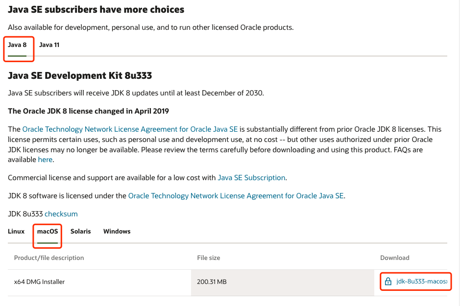

在终端（terminal）输入java -version查看本机JDK版本


## 安装Jmeter

进入官网下载 https://jmeter.apache.org/download_jmeter.cgi


解压后进入目录/apache-jmeter-5.5/bin，双击ApacheJMeter.jar即可运行，可制作1个替身放到应用程序

需要调整配置参数解决中文乱码问题，修改文件/apache-jmeter-5.5/bin/jmeter.properties

查找sampleresult.default.encoding（默认的编码格式），此参数默认注释，调整为UTF-8

```
sampleresult.default.encoding=UTF-8
```

修改配置后重启即可生效


## 设置测试计划

### 设置请求头


常用请求头Content-Type: application/json;charset=UTF-8

### 添加变量

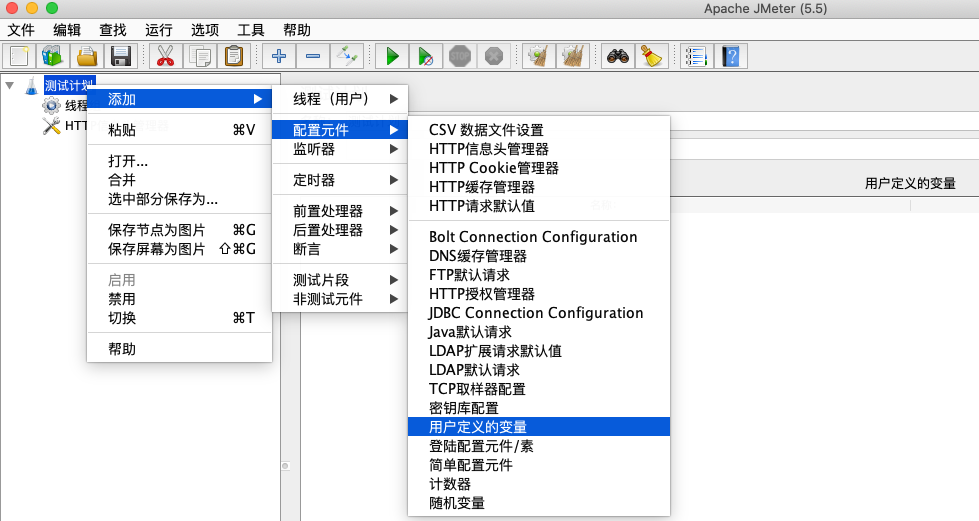

一般会对接口的ip和port做变量定义方便使用


使用时用${名称}

### 新建线程组

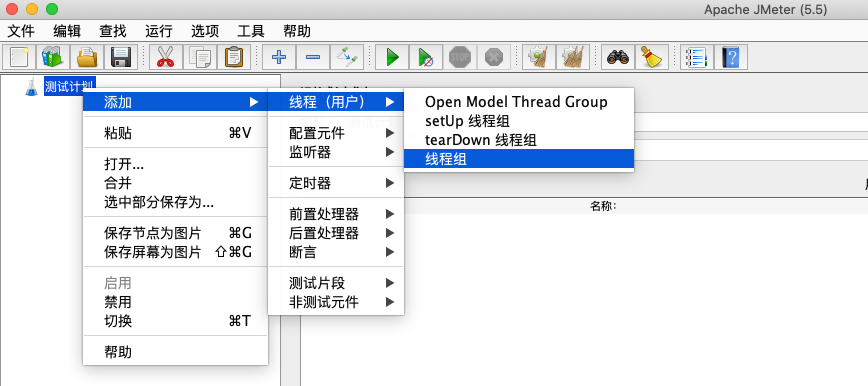

配置线程组

假设要在5秒内新建10个线程

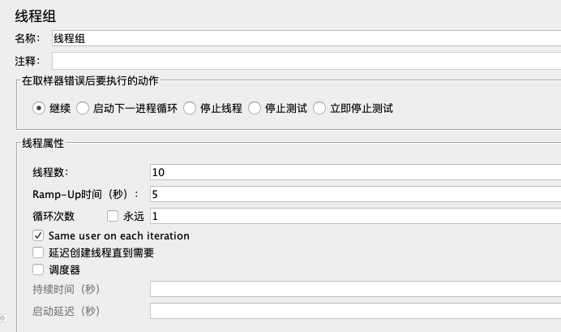

### 新建http请求

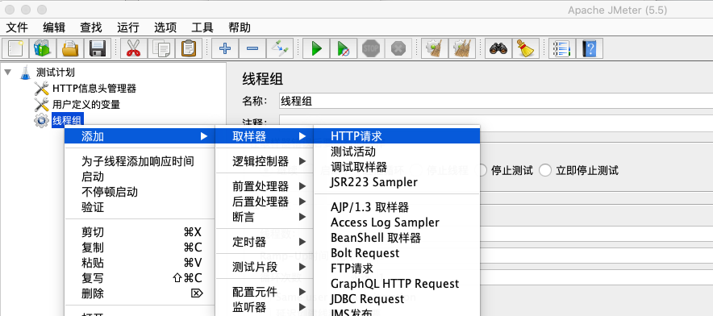

编辑接口信息，以登陆接口为例，使用了之前定义的变量，接口传参通过消息体数据填写


### 添加查看结果树

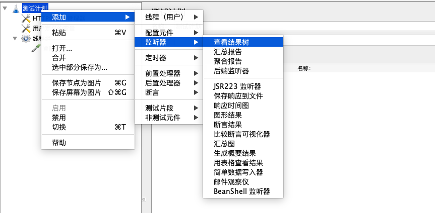

### 添加汇总报告


### 添加响应时间图

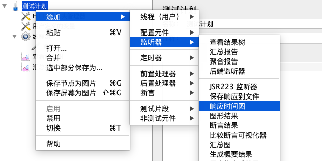

需要对图表进行简单配置，如时间间隔，可配置的再小一些，如1000

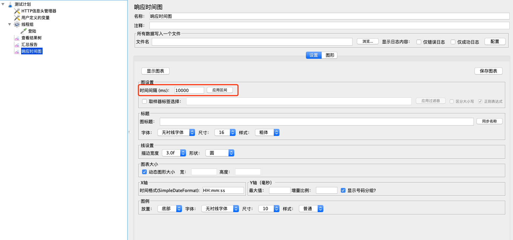

## 开始测试

点击绿色箭头开始测试，根据线程组配置，5秒内10个线程请求登陆接口


运行过程中绿色箭头置灰，可点击stop按钮暂停测试或关闭按钮停止测试，测试完成后绿色箭头恢复可点击

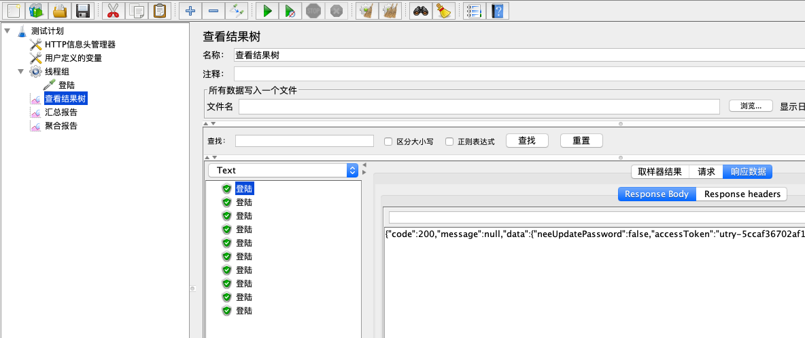

可以看到10次接口调用都成功返回，再查看汇总报告


可通过图形更直观的看到实际执行的结果

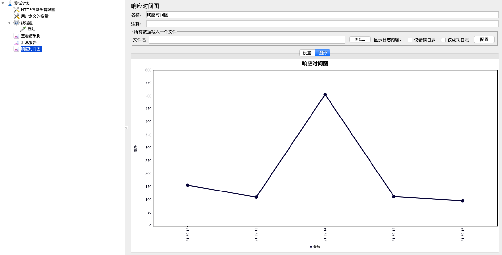


## 进阶使用

### 接口结果传递

正常业务场景，需要在登陆后获取登陆接口返回的票据，再后续接口请求头中都需要增加票据来实现权限认证，那么需要对登陆接口增加后置处理器

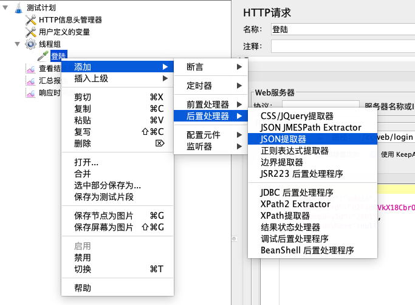

### 获取接口返回的票据并添加为变量


### 在HTTP信息头管理器中添加票据


### 验证请求头

新增一个http请求


再次点击测试后查看结果树，请求-请求头，可以看到请求头中已经有了票据


## 安装插件

为了更好的使用工具，需要安装插件，首先需要安装jar包，然后安装说明放入指定目录后重启生效

https://jmeter-plugins.org/install/Install/


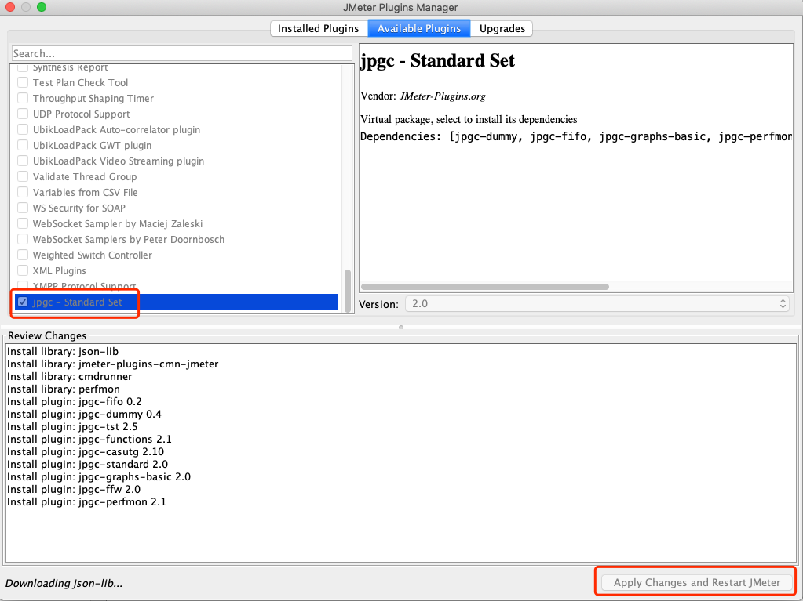

插件包可能安装失败，可以直接下载插件包 https://jmeter-plugins.org/downloads/old/

JMeterPlugins-Standard-1.4.0.zip https://jmeter-plugins.org/downloads/file/JMeterPlugins-Standard-1.4.0.zip

JMeterPlugins-Extras-1.4.0.zip https://jmeter-plugins.org/downloads/file/JMeterPlugins-Extras-1.4.0.zip

解压后分别把/lib/ext中的JMeterPlugins-Extras.jar和JMeterPlugins-Standard.jar拷贝到/apache-jmeter-5.5/lib/ext目录，重启Jmeter就可以看到插件


## 其他压测方式

通过新增不同的线程组来实现

### jp@gc - Stepping Thread Group


配置参数，使线程可促次递增

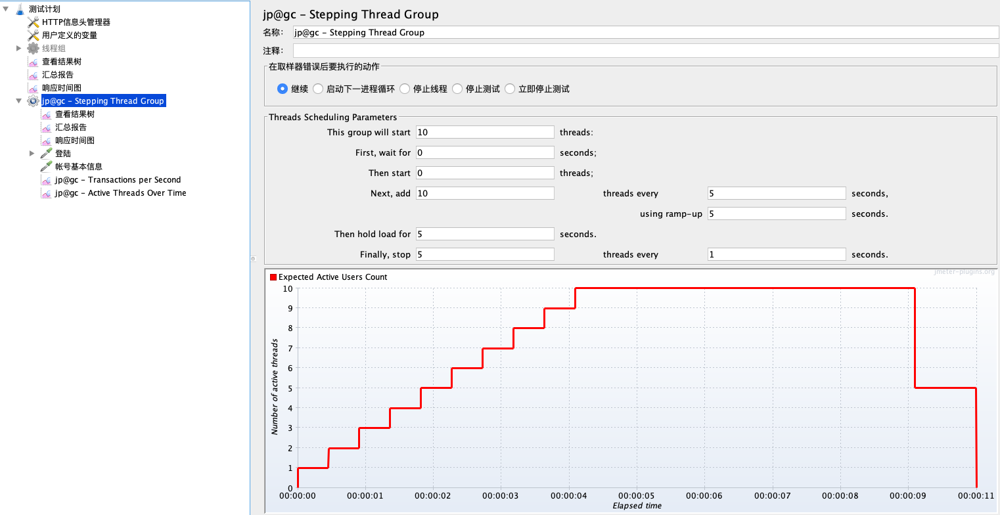

同时配置jp@gc - Transactions per Second和jp@gc - Active Threads Over Time来观察数据变化


### jp@gc - Ultimate Thread Group

配置更自由

