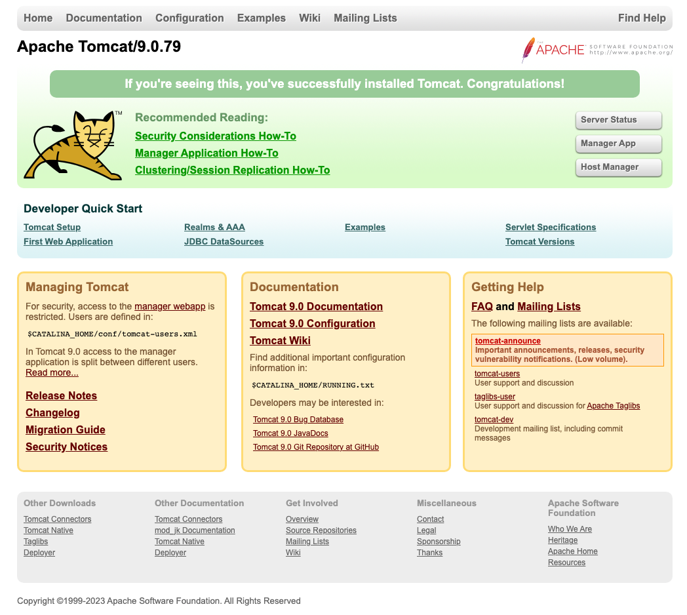

# Tomcat入门

## 安装Java

> JDK20来了，但是据说大部分情况下还是用的8

下载 Java SE Development Kit 8u381

https://www.oracle.com/cn/java/technologies/downloads/#java8

## 安装Tomcat

官方下载

https://tomcat.apache.org/download-90.cgi

- 2023-08-15 Tomcat 9.0.79 Released

  - The Apache Tomcat Project is proud to announce the release of version 9.0.79 of Apache Tomcat. This release implements specifications that are part of the Java EE 8 platform.

这个版本就是搭配jdk1.8使用

下载Core到zip包就可以了

https://dlcdn.apache.org/tomcat/tomcat-9/v9.0.79/bin/apache-tomcat-9.0.79.zip

zip解压后建议文件夹改名`Tomcat`，并放到自定义目录，如`/usr/local`

## 目录结构

```
├── bin                     系统命令，如启动，关闭
├── conf                    配置文件
│   ├── server.xml          服务器信息
│   ├── tomcat-users.xml    用户信息
│   └── web.xml             支持的文件类型
├── lib                     运行需要加载的jar包
├── logs                    日志文件
├── temp                    临时文件
├── webapps                 应用程序，默认5个
│   ├── ROOT
│   ├── docs
│   ├── examples
│   ├── host-manager
│   └── manager
└── work                    运行时的编译后的文件
```

## 修改默认端口号

因为Tomcat默认端口号是8080，如果本地安装了nginx，端口号冲突了，建议修改端口号后再启动服务

打开文件`conf/server.xml`，查找`8080`，修改为`9090`

```
    <Connector port="9090" protocol="HTTP/1.1"
               connectionTimeout="20000"
               redirectPort="8443"
               maxParameterCount="1000"
               />
```

## 启动服务

> /usr/local/Tomcat为Tomcat所在目录

```bash
sh /usr/local/Tomcat/bin/startup.sh
```

执行成功后返回如下信息

```
Using CATALINA_BASE:   /usr/local/Tomcat
Using CATALINA_HOME:   /usr/local/Tomcat
Using CATALINA_TMPDIR: /usr/local/Tomcat/temp
Using JRE_HOME:        /Library/Java/JavaVirtualMachines/jdk1.8.0_333.jdk/Contents/Home
Using CLASSPATH:       /usr/local/Tomcat/bin/bootstrap.jar:/usr/local/Tomcat/bin/tomcat-juli.jar
Using CATALINA_OPTS:
Tomcat started.
```

## 验证服务

访问`http://localhost:9090/`，出现默认页面说明安装成功



## 重启服务

简单来说分2步

- 关闭服务 `sh /usr/local/Tomcat/bin/shutdown.sh`
- 启动服务 `sh /usr/local/Tomcat/bin/startup.sh`

## 增加应用程序

### war包

后端编译出来的`api.war`拷贝到webapps目录，tomcat会自动解压

访问路径`http://localhost:9090/api`

### 静态网站

vue编译出来的`dist`拷贝到webapps目录

访问路径`http://localhost:9090/dist`

## 更新应用程序

同名war包更新，或配置文件更新，需要重启Tomcat生效

如java配置文件相对路径`/WEB-INF/classes/config/application.yml`

## 可视化管理后台

需要设置用户名和密码,修改conf/tomcat-users.xml，查找`<tomcat-users`

增加用户信息

```
<role rolename="manager-gui"/>
<user username="tomcat" password="s3cret" roles="manager-gui"/>
```

可以通过网页管理应用程序

http://localhost:9090/manager/html


## 日志切割方案

> catalina.out文件会随着系统运行越来越大，官方未提供方案，此为常见的处理方案

- 新建切割日志脚本
- 每天定时执行脚本
- 手动按需清理文件

在tomcat目录下新建`catLog.sh`

```sh
#!/bin/bash

DATE=`date "+%Y-%m-%d"`

cp ./logs/catalina.out ./logs/catalina.out.$DATE

wait

echo " " > ./logs/catalina.out
```

增加一条定时任务

```bash
crontab -e
```

新增以下行

```
0 0 * * * sh /usr/local/Tomcat/catLog.sh
```

保存并退出后查看存在的定时任务

```bash
crontab -l
```

确认后即可实现每天0点对`catalina.out`文件按照日期切割为新的日志文件，并清空原有文件，可按需手动清除指定日期的日志文件
