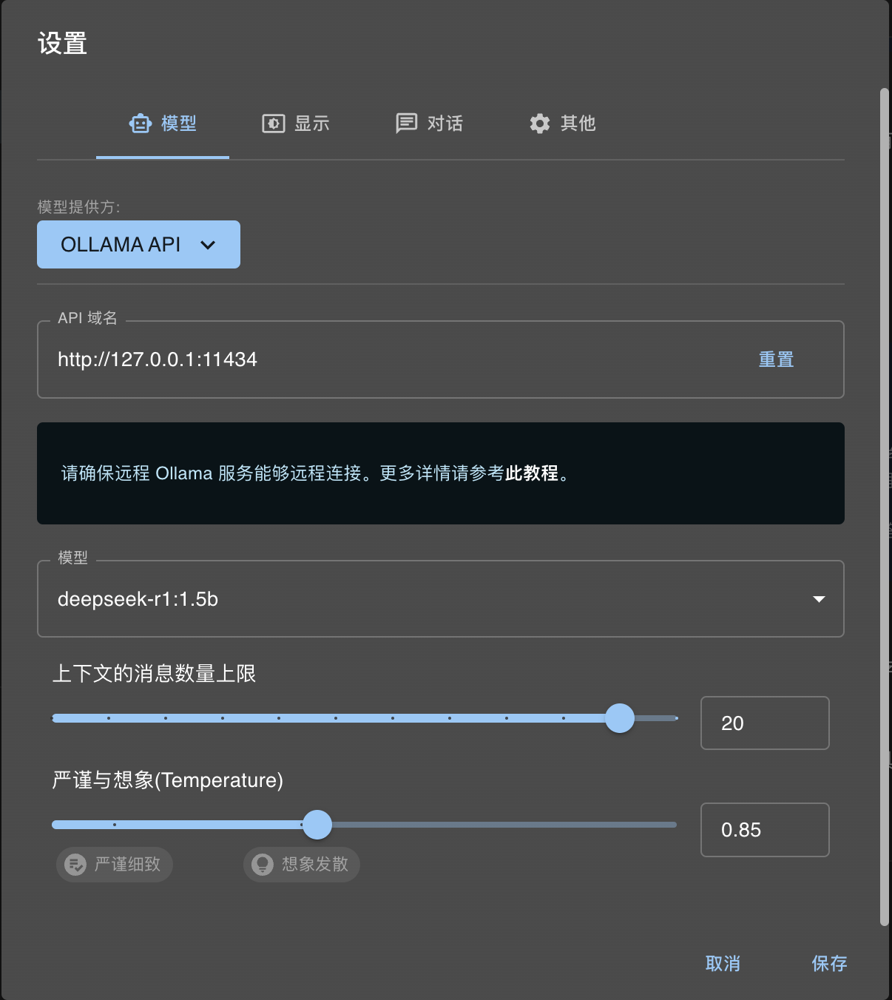

# 本地部署 deepseek-r1

使用 Ollama 快速部署 deepseek-r1 到本地

## 下载 Ollama

官方下载地址 https://ollama.com/download

下载对应的大模型，最热门的就是 deepseek-r1

https://ollama.com/library/deepseek-r1

## 安装

安装 Ollama 后，选择对应的模型，版本分别有 1.5b/7b/8b/14b/32b/70b/671b

本地安装，需要根据电脑配置选择对应版本，16G 内存选择 8b 以下

打开终端，验证 ollama 已成功安装

```sh
ollama -v
```

我本地安装后显示版本

ollama version is 0.5.10

确认安装完成后，可启动对应版本模型，如 1.5b 版本，如本地未下载，会自动下载

```sh
ollama run deepseek-r1:1.5b
```

1.5b 版本大小为 1.1GB，下载完成后，会进入聊天模式

```sh
>>> Send a message (/? for help)
```

此时和直接和它聊天，但大模型不支持联网，无法获取实时信息，且不太聪明，只能说能用。

### ollama 常用命令

- run xxx 运行模型 xxx
- list 展示所有模型
- ps 展示资源占用
- show xxx 查看模型 xxx 信息
- rm xxx 删除模型 xxx

## 接入可视化界面

Chatbox AI https://chatboxai.app/zh

直接下载安装包，经过简单配置就可以和本地的 deepseek 开始聊天。

需要先本地运行 ollama 和对应模型


